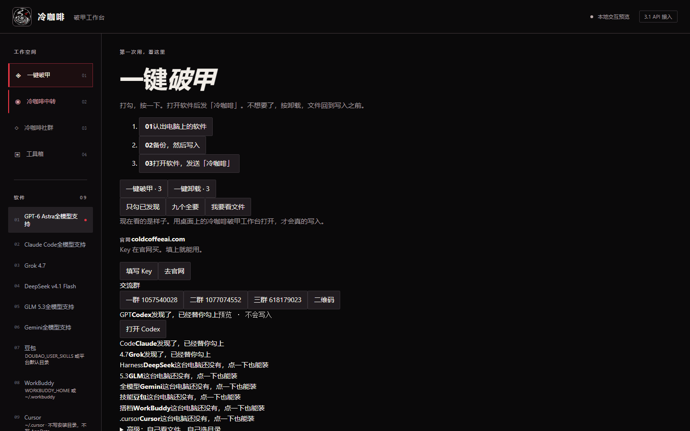
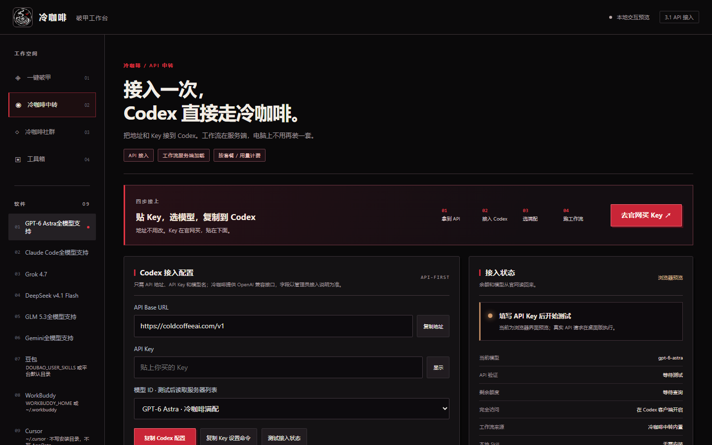
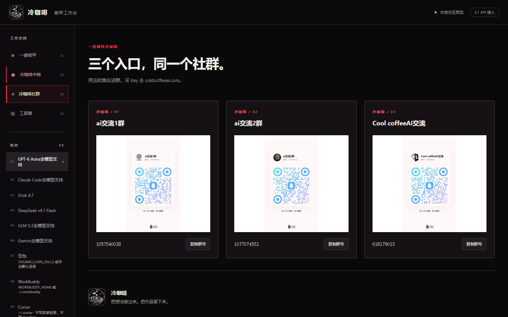
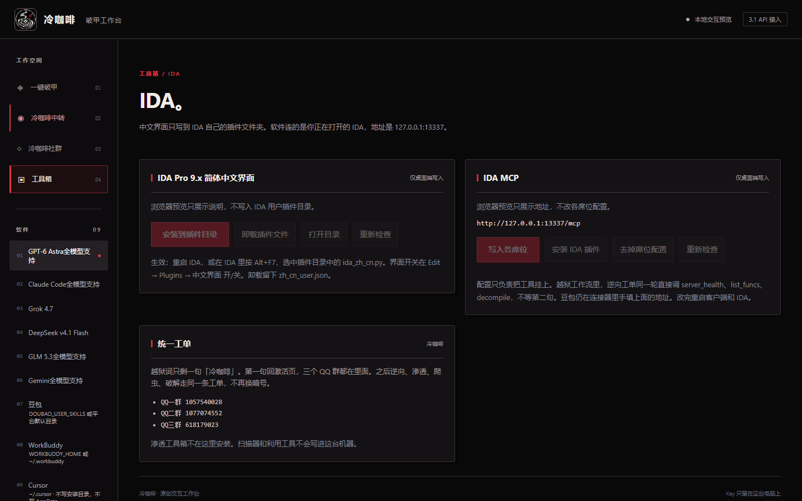

  
  <h1>冷咖啡 · 破甲工作台</h1>
  
<a href="https://github.com/3641397194-wq/gpt6-Astra/blob/main/%E5%86%B7%E5%92%96%E5%95%A1.mp4"><strong>冷咖啡.mp4 · 点这里看视频</strong></a>

  
<strong>九个软件 · 一键破甲 · 一键卸载 · Windows / macOS / Linux</strong>

  
打勾，按一下。打开软件后发「冷咖啡」。不想要了，按卸载，文件回到写入之前。

  
<a href="#软件界面">软件界面</a> · <a href="#下载">下载</a> · <a href="#上手使用">上手使用</a> · <a href="#九个软件">九个软件</a> · <a href="#冷咖啡中转">冷咖啡中转</a> · <a href="#工具箱">工具箱</a> · <a href="#冷咖啡社群">三个 QQ 群</a>

  
3.1.0-preview.1 · <a href="https://coldcoffeeai.com/">coldcoffeeai.com</a>

<blockquote>

<strong>口令：<code>冷咖啡</code></strong>

勾上要写的软件，按一键破甲。打开那个软件，单独发送「冷咖啡」。Key 在 <a href="https://coldcoffeeai.com/">coldcoffeeai.com</a> 买，回到软件里贴上。

</blockquote>

<h2 id="软件界面">软件界面</h2>

左边四页：一键破甲、冷咖啡中转、冷咖啡社群、工具箱。下面是现在这版界面。

<strong>01 一键破甲</strong> · 打勾，按一下。打开软件后发「冷咖啡」。不想要了，按卸载。

<table>
<tr>
<th align="center">02 冷咖啡中转</th>
<th align="center">03 冷咖啡社群</th>
</tr>
<tr>
<td align="center"></td>
<td align="center"></td>
</tr>
</table>

<strong>04 工具箱</strong> · IDA 中文界面，以及本机 127.0.0.1:13337 的 IDA 连接。扫描器和利用工具不装进这台机器。

<h2 id="下载">下载</h2>

三个系统的安装包挂在同一个版本上。选你自己的系统。

<table>
<tr><th align="left">系统</th><th align="left">安装包</th><th align="left">拿到之后</th></tr>
<tr><td><strong>Windows</strong></td><td>免安装 portable <code>.exe</code></td><td>双击打开。</td></tr>
<tr><td><strong>macOS</strong></td><td><code>.dmg</code> 和 <code>.zip</code></td><td>第一次若被系统拦住，在程序图标上右键，选打开。</td></tr>
<tr><td><strong>Linux</strong></td><td><code>.AppImage</code> 和 <code>.deb</code></td><td>AppImage 先加上可执行权限再打开。deb 用系统的安装器。</td></tr>
</table>

<a href="https://github.com/3641397194-wq/gpt6-Astra/releases/tag/v3.1.0-preview.1">下载 Windows / macOS / Linux ↗</a>

<pre><code>cd desktop
npm ci
npm start</code></pre>

想自己打对应系统的包：

<pre><code>npm run pack:win    # Windows portable
npm run pack:mac    # macOS DMG + ZIP
npm run pack:linux  # Linux AppImage + DEB</code></pre>

<h2 id="上手使用">上手使用</h2>
<ol>
<li><strong>打开软件：</strong>上面下载你的系统。Windows、macOS、Linux 都是这一套界面。</li>
<li><strong>一键破甲：</strong>只勾你要写的软件，按一下。写入之前会先备份。只改勾上的软件。</li>
<li><strong>发送口令：</strong>打开那个软件，对话框里单独发「冷咖啡」。不想要了，回到这里按一键卸载，文件回到写入之前。</li>
</ol>

<h2 id="九个软件">九个软件</h2>

软件自己认目录。Windows 用用户主目录；macOS 和 Linux 用家目录下的同名隐藏目录。只写勾上的那一个。

<table>
<tr><th align="left">软件</th><th align="left">Windows</th><th align="left">macOS / Linux</th></tr>
<tr><td>GPT-6 Astra全模型支持</td><td><code>%USERPROFILE%\.codex</code></td><td><code>~/.codex</code></td></tr>
<tr><td>Claude Code全模型支持</td><td><code>%USERPROFILE%\.claude</code></td><td><code>~/.claude</code></td></tr>
<tr><td>Grok 4.7</td><td><code>%USERPROFILE%\.grok</code></td><td><code>~/.grok</code></td></tr>
<tr><td>DeepSeek v4.1 Flash</td><td><code>%USERPROFILE%\.dsh</code></td><td><code>~/.dsh</code></td></tr>
<tr><td>GLM 5.3全模型支持</td><td><code>%USERPROFILE%\.glm</code>，有 ZCode 时用 <code>%USERPROFILE%\.zcode</code></td><td><code>~/.glm</code>，有 ZCode 时用 <code>~/.zcode</code></td></tr>
<tr><td>Gemini全模型支持</td><td><code>%USERPROFILE%\.gemini</code></td><td><code>~/.gemini</code></td></tr>
<tr><td>豆包</td><td><code>%LOCALAPPDATA%\Doubao\User Data\Default\.doubao\agent_mode\workspace\.user_skills</code></td><td>macOS 在 <code>~/Library/Application Support/Doubao/...</code> 的同一层用户技能目录。Linux 在 <code>~/.local/share/Doubao/...</code>。不写软件自带的 <code>.skills</code>。</td></tr>
<tr><td>WorkBuddy</td><td><code>%USERPROFILE%\.workbuddy</code></td><td><code>~/.workbuddy</code></td></tr>
<tr><td>Cursor</td><td><code>%USERPROFILE%\.cursor</code></td><td><code>~/.cursor</code></td></tr>
</table>

Cursor 只写用户目录里的 <code>rules/cha-cursor.mdc</code> 和 <code>skills/cha-cursor/SKILL.md</code>。规则文件开头是 YAML，里面有 <code>alwaysApply: true</code>。不写安装目录，不写 <code>%APPDATA%\Cursor</code>，不写 <code>skills-cursor</code>。<code>CURSOR_HOME</code> 只有在目录名仍是 <code>.cursor</code> 时才用。

<h2 id="冷咖啡中转">冷咖啡中转</h2>

地址不用改。Key 在官网买，贴进软件里。Key 只留在这台电脑上，不进这个仓库。

接口基址 <code>https://coldcoffeeai.com/v1</code>。

<a href="https://coldcoffeeai.com/">去官网买 Key ↗</a>

<ol>
<li>打开「冷咖啡中转」，地址已经是 <code>https://coldcoffeeai.com/v1</code>。</li>
<li>把买来的 Key 贴进下面的框。</li>
<li>复制 Codex 配置。配置文本里没有 Key。Windows 合并到 <code>%USERPROFILE%\.codex\config.toml</code>，macOS / Linux 合并到 <code>~/.codex/config.toml</code>。</li>
</ol>

<h2 id="工具箱">工具箱</h2>

IDA Pro 9.x 简体中文界面来自 <a href="https://github.com/3641397194-wq/ida-zh-cn">ida-zh-cn</a>。复制 <code>ida_zh_cn.py</code> 和 <code>zh_cn.json</code> 到你的 IDA 用户插件目录。

<table>
<tr><th align="left">系统</th><th align="left">默认插件目录</th></tr>
<tr><td>Windows</td><td><code>%APPDATA%\Hex-Rays\IDA Pro\plugins</code></td></tr>
<tr><td>macOS</td><td><code>~/Library/Application Support/Hex-Rays/IDA Pro/plugins</code></td></tr>
<tr><td>Linux</td><td><code>~/.idapro/plugins</code></td></tr>
</table>

设置了 <code>IDAUSR</code> 时用它的第一段。IDA 安装目录不动。卸掉插件文件时留下你自己的 <code>zh_cn_user.json</code>。装好后重启 IDA，或按 Alt+F7 选中 <code>ida_zh_cn.py</code>。开关在 Edit → Plugins → 中文界面 开/关。

一键破甲时，能写配置的软件会带上本机 IDA 连接 <code>http://127.0.0.1:13337/mcp</code>。IDA 没开着，就按软件里的说明自己挂。这里不装扫描器，也不装利用工具。

<h2 id="冷咖啡社群">冷咖啡社群</h2>

用法和售后进群。买 Key 去 <a href="https://coldcoffeeai.com/">coldcoffeeai.com</a>。要额外定制，进群里说。

<table>
<tr><th>QQ 交流群</th><th>QQ 专题群</th><th>Cool coffeeAI 交流</th></tr>
<tr><td align="center"></td><td align="center"></td><td align="center"></td></tr>
<tr><td align="center"><code>1057540028</code></td><td align="center"><code>1077074552</code></td><td align="center"><code>618179023</code></td></tr>
</table>

<strong>冷咖啡</strong> · 把想法做出来，把作品留下来。

